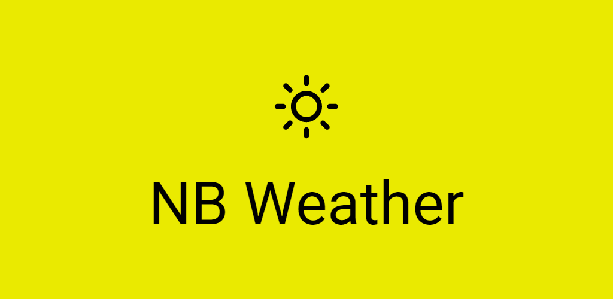
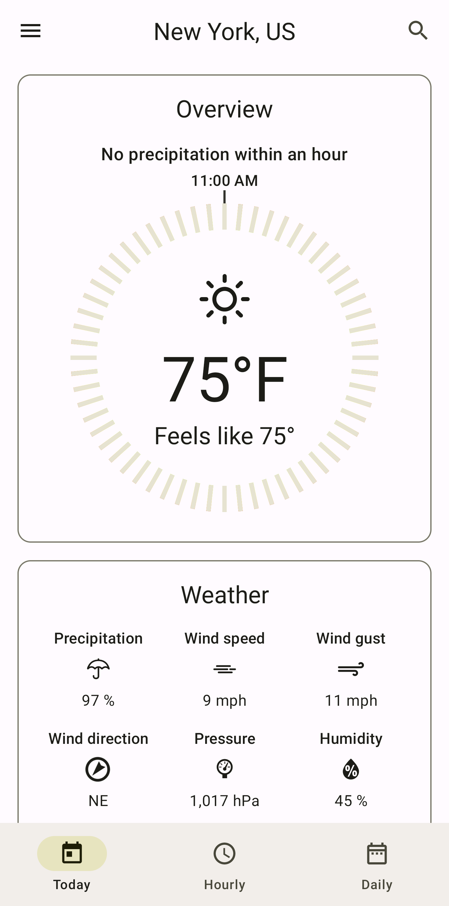
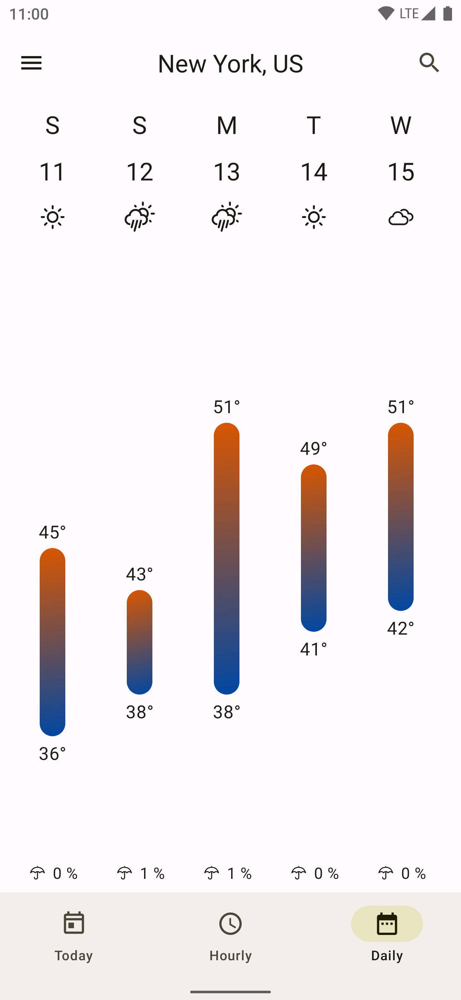
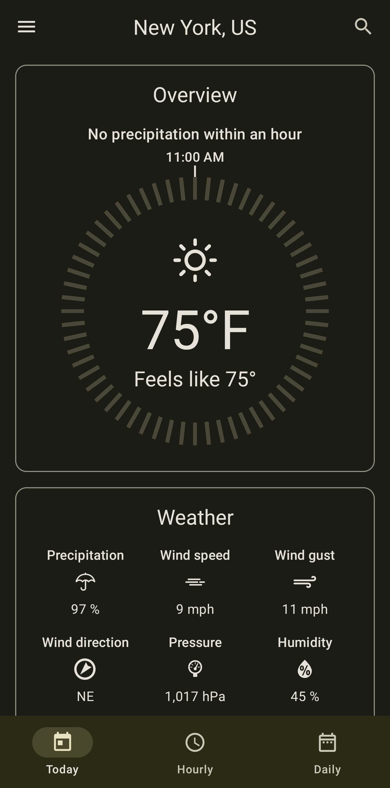
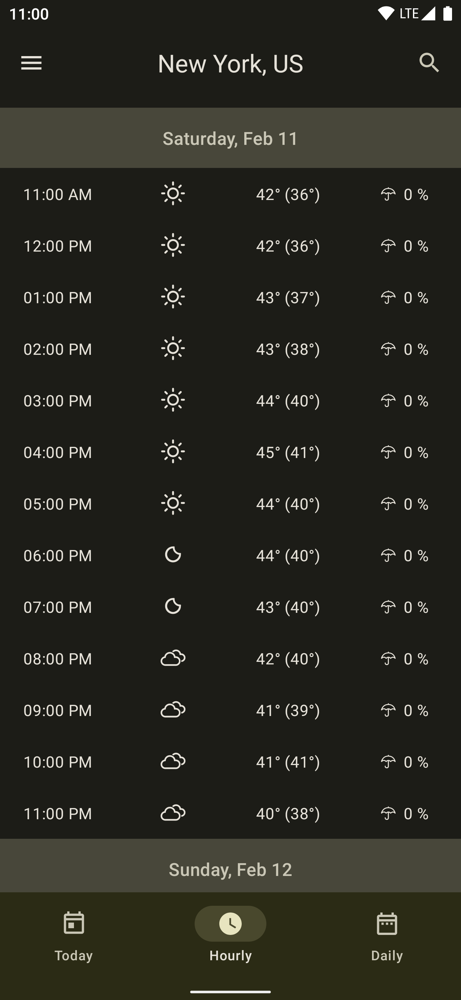
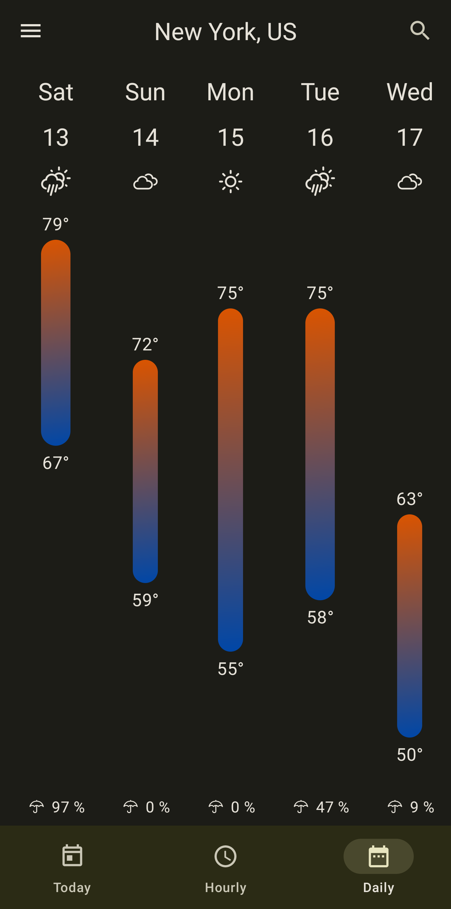

# NB Weather

## App

**NB Weather** is a fully functional Android weather app built with Kotlin and Jetpack Compose.

### Screenshots

| Today | Hourly | Daily |
| :---: | :----: | :---: |
|  |  |  |
|  |  |  |

### Modularization

#### Types

| Type      | Description                                 | Depends on |
| :-------: | :-----------------------------------------: | :--------: |
| `app`     | Combines all modules and handles navigation | `core` `data` `feature` `test`                       |
| `core`    | Implementation used by multiple modules     | - |
| `data`    | Data fetching and storing                   | `core` `test` |
| `feature` | Feature within the app                      | `core` `data` `test` |
| `test`    | Tests used by multiple modules              | `core` |

#### Layers

| Layer                     | Description                     | Important dependencies |
| :-----------------------: | :-----------------------------: | :--------------------: |
| `common`                  | Code used by all layers         | - |
| `data-disk`               | Managing preferences            | [DataStore](https://developer.android.com/topic/libraries/architecture/datastore) [Protobuf](https://github.com/google/protobuf-gradle-plugin) |
| `data-localremote`        | Combining local and remote data | [Coroutines](https://developer.android.com/kotlin/coroutines) |
| `data-localremote-local`  | Managing local data             | [Room](https://developer.android.com/training/data-storage/room) |
| `data-localremote-remote` | Managing remote data            | [Moshi](https://github.com/square/moshi) [OkHttp](https://github.com/square/okhttp) [Retrofit](https://github.com/square/retrofit) [Secrets](https://github.com/google/secrets-gradle-plugin) |
| `ui`                      | Managing ui views and models    | [Google Accompanist](https://google.github.io/accompanist/) [Jetpack Compose](https://developer.android.com/jetpack/compose) [Material 3](https://m3.material.io/) |

##### Layer independent dependencies

| Dependency | Usage |
| :--------: | :---: |
| [AndroidX Test (Espresso and JUnit)](https://developer.android.com/jetpack/androidx/releases/test) | Testing |
| [Firebase Crashlytics](https://firebase.google.com/docs/crashlytics/) | Crash reporting |
| [Hilt](https://developer.android.com/training/dependency-injection/hilt-android) | Dependency Injection |
| [Timber](https://github.com/JakeWharton/timber) | Logging |

## Development Environment

### Building the app

To build this app, you need an OpenWeather API key that you can get by registering on their [website](https://home.openweathermap.org/users/sign_in).  
Then, in your `local.properties`, you need to enter a new variable with the name `openweathermap.apiKey` and your API key as the value.

### Useful gradle commands

| Command | Usage | Report location |
| :-----: | :---: | :-------------: |
| `./gradlew connectedAndroidTest mergeAndroidReports --continue` | [Run all tests](https://developer.android.com/studio/test/command-line) | **build/androidTest-results/index.html** |
| `/.gradlew dependencyUpdates` | [Dependency version check](https://github.com/ben-manes/gradle-versions-plugin) | **build/dependencyUpdates/report.html** |

## Credits

| Name | Usage |
| :--: | :---: |
| [Erik Flowers](https://erikflowers.github.io/weather-icons/) | App icon and weather icons |
| [Material Color Utilities](https://github.com/material-foundation/material-color-utilities) | Module `library-materialcolorutilities` for creating material 3 color scheme and blending colors |
| [OpenWeather](https://openweathermap.org/) | Weather data |

## License

**NB Weather** is distributed under the terms of the MIT License. See the
[license](LICENSE) for more information.
