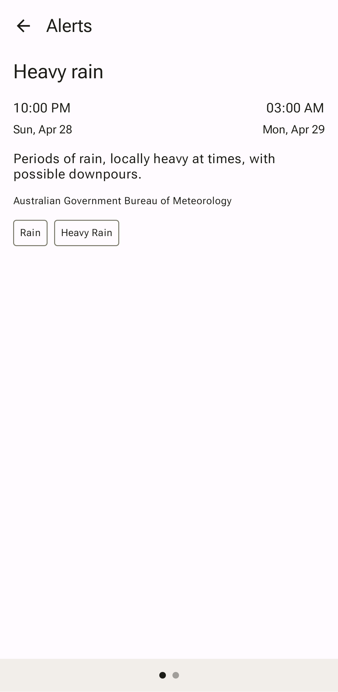
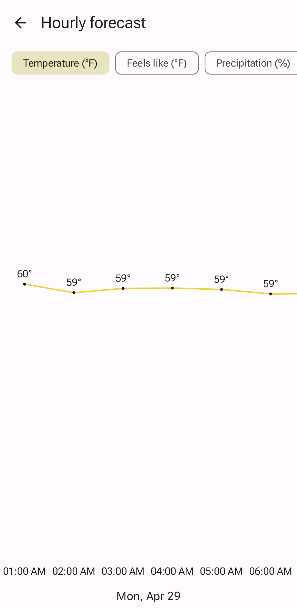
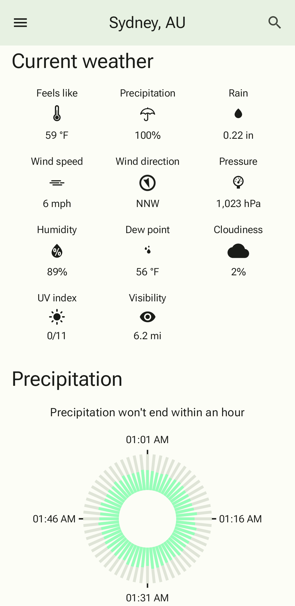
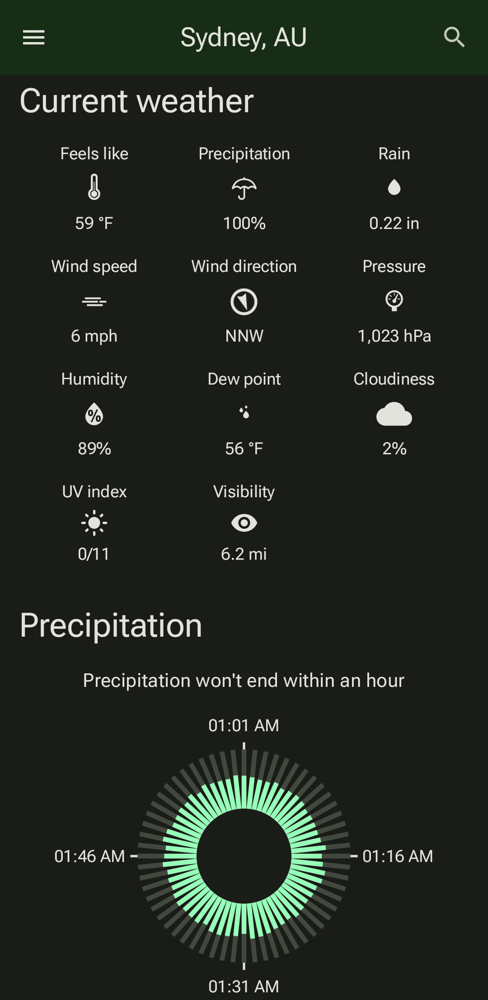
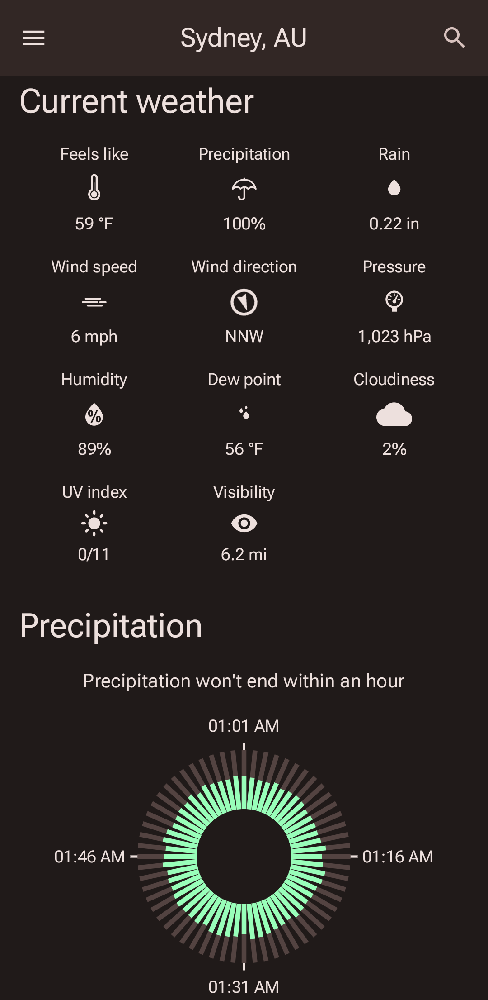
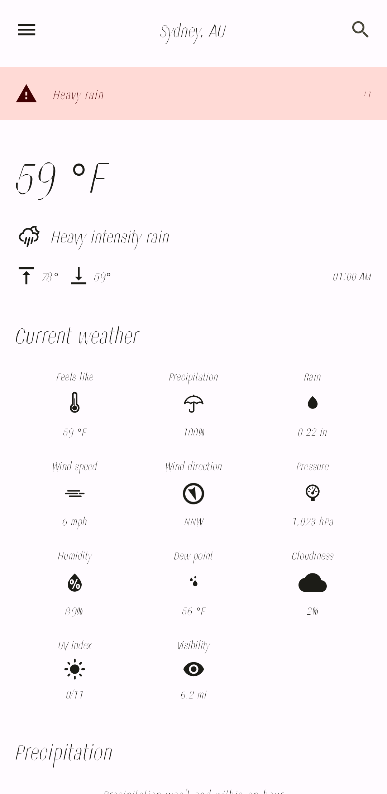
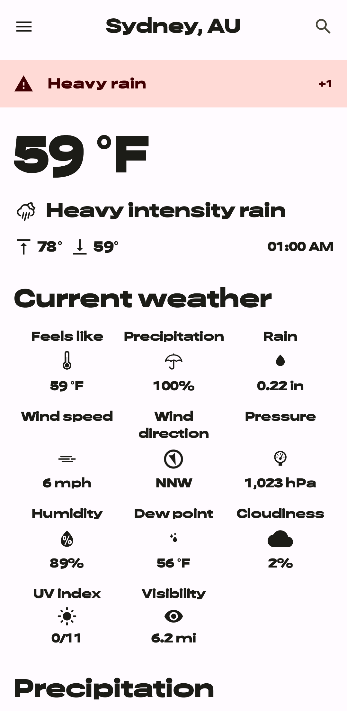

# NB Weather


<a href="https://play.google.com/store/apps/details?id=de.niklasbednarczyk.nbweather"></a>

## Features

**NB Weather** is a fully functional Android weather app built with Kotlin and Jetpack Compose.

### Forecast

#### Overview

Users can view weather forecasts for various locations worldwide. The forecast items include:

- Alerts
- Summary
- Current weather
- Precipitation
- Hourly forecast
- Daily forecast
- Sun and moon

#### Detail screens

Some forecast items have detail screens that users can access by clicking on them:

|                                                          Alerts                                                           |                                                                   Hourly forecast                                                                    |                                                                  Daily forecast                                                                   |
|:-------------------------------------------------------------------------------------------------------------------------:|:----------------------------------------------------------------------------------------------------------------------------------------------------:|:-------------------------------------------------------------------------------------------------------------------------------------------------:|
|  |  |  |

### Search

Locations around the world can be found in two ways:

- Search by name
- Search by location of device

Visited locations can also be reordered and deleted.

### Settings

#### Appearance

There are two themes and four color schemes available:

|           |                                                                       Blue                                                                        |                                                                        Green                                                                         |                                                                      Red                                                                       |                                                                         Yellow                                                                          |
|:---------:|:-------------------------------------------------------------------------------------------------------------------------------------------------:|:----------------------------------------------------------------------------------------------------------------------------------------------------:|:----------------------------------------------------------------------------------------------------------------------------------------------:|:-------------------------------------------------------------------------------------------------------------------------------------------------------:|
| **Light** |  |  |  |  |
| **Dark**  |     |     |     |     |

The theme can be based on the device's system default.

For users with Android 12 devices, there is also an option to use a [Material 3 dynamic color scheme](https://m3.material.io/styles/color/dynamic/choosing-a-source) that is generated from a user's wallpaper.

#### Font

The app uses the variable font [Roboto Flex](https://fonts.google.com/specimen/Roboto+Flex) which allows for customization of font axes:

|                                              All axes with minimum value                                               |                                              All axes with maximum value                                               |
|:----------------------------------------------------------------------------------------------------------------------:|:----------------------------------------------------------------------------------------------------------------------:|
|  |  |

#### Units

Several units are available to display forecast data:

##### Temperature

- Celsius (°C)
- Fahrenheit (°F)
- Kelvin (K)

##### Precipitation

- Inch (in)
- Millimeter (mm)

##### Distance

- Kilometer (km)
- Mile (mi)

##### Pressure

- Hectopascal (hPa)
- Inch of mercury (inHg)
- Millimeter of mercury (mmHg)

##### Wind speed

- Kilometer per hour (km/h)
- Meter per second (m/s)
- Mile per hour (mph)

#### Order

Users have the ability to rearrange the order of [forecast items](#overview) (excluding alerts and summary).

#### Languages

The app fully supports the following languages:

- English (en)
- German (de)

## Development Environment

### Build variants

#### Product flavors and build types

| Product flavor | Build type | Application id suffix |                                                  Requirements                                                   |                Usage                 |
|:--------------:|:----------:|:---------------------:|:---------------------------------------------------------------------------------------------------------------:|:------------------------------------:|
|     `demo`     |  `debug`   |     `.demo.debug`     |                                                        -                                                        | Allows developers to explore the app |
|     `demo`     | `release`  |        `.demo`        |              [Firebase Crashlytics](#firebase-crashlytics) </br> [Release config](#release-config)              |           GitHub releases            |
|     `prod`     |  `debug`   |       `.debug`        |                                               [API key](#api-key)                                               |       Debugging with real data       |
|     `prod`     | `release`  |           -           | [API key](#api-key) </br> [Firebase Crashlytics](#firebase-crashlytics) </br> [Release config](#release-config) |      Google Play Store releases      |

#### Demo locations

|   Name   |                                                                   Country                                                                    |                          Usage                          |
|:--------:|:--------------------------------------------------------------------------------------------------------------------------------------------:|:-------------------------------------------------------:|
| New York |  | Screenshots for the `en-US` locale on Google Play Store |
|  Berlin  |              | Screenshots for the `de-DE` locale on Google Play Store |
| Auckland |      |                          Tests                          |

#### Firebase Crashlytics

The `release` build type requires a connection to [Firebase Crashlytics](https://firebase.google.com/products/crashlytics), so you need to replace the placeholder file `app\google-services.json` with a file with real values.

To prevent git from not tracking the file when you change it, run this command:

```bash
git update-index --skip-worktree app\google-services.json
```

#### Release config

The `release` build type requires the following signing variables in your `local.properties`:

```properties
signingconfig.release.storefilepath=<your store file path>
signingconfig.release.keyalias=<your key alias>
signingconfig.release.storepassword=<your store password>
signingconfig.release.keypassword=<your key password>
```

#### API key

The `prod` product flavor requires an [OpenWeather API key](https://home.openweathermap.org/users/sign_in) in your `local.properties`:

```properties
openweathermap.apiKey=<your OpenWeather API key>
```

### Reports

|                             Command                             |                                      Usage                                      |            Report location             |
|:---------------------------------------------------------------:|:-------------------------------------------------------------------------------:|:--------------------------------------:|
| `./gradlew connectedAndroidTest mergeAndroidReports --continue` |     [Run all tests](https://developer.android.com/studio/test/command-line)     | `build/androidTest-results/index.html` |
|                  `./gradlew dependencyUpdates`                  | [Dependency version check](https://github.com/ben-manes/gradle-versions-plugin) | `build/dependencyUpdates/report.html`  |

## Modularization

### Types

|   Type    |                 Description                 |                 Depends on                 |
|:---------:|:-------------------------------------------:|:------------------------------------------:|
|   `app`   | Combines all modules and handles navigation | `core`</br>`data`</br>`feature`</br>`test` |
|  `core`   |   Implementation used by multiple modules   |                     -                      |
|  `data`   |          Data fetching and storing          |             `core`</br>`test`              |
| `feature` |           Feature within the app            |        `core`</br>`data`</br>`test`        |
|  `test`   |       Tests used by multiple modules        |                   `core`                   |

### Layers

|           Layer           |           Description           |                                                                                          Important dependencies                                                                                           |
|:-------------------------:|:-------------------------------:|:---------------------------------------------------------------------------------------------------------------------------------------------------------------------------------------------------------:|
|         `common`          |     Code used by all layers     |                                                                                                     -                                                                                                     |
|        `data-disk`        |      Managing preferences       |                            [DataStore](https://developer.android.com/topic/libraries/architecture/datastore)</br>[Protobuf](https://github.com/google/protobuf-gradle-plugin)                             |
|    `data-localremote`     | Combining local and remote data |                                                                       [Coroutines](https://developer.android.com/kotlin/coroutines)                                                                       |
| `data-localremote-local`  |       Managing local data       |                                                                     [Room](https://developer.android.com/training/data-storage/room)                                                                      |
| `data-localremote-remote` |      Managing remote data       | [Moshi](https://github.com/square/moshi)</br>[OkHttp](https://github.com/square/okhttp)</br>[Retrofit](https://github.com/square/retrofit)</br>[Secrets](https://github.com/google/secrets-gradle-plugin) |
|           `ui`            |  Managing ui views and models   |                                                [Jetpack Compose](https://developer.android.com/jetpack/compose)</br>[Material 3](https://m3.material.io/)                                                 |

#### Layer independent dependencies

|                                             Dependency                                             |        Usage         |
|:--------------------------------------------------------------------------------------------------:|:--------------------:|
| [AndroidX Test (Espresso and JUnit)](https://developer.android.com/jetpack/androidx/releases/test) |       Testing        |
|               [Firebase Crashlytics](https://firebase.google.com/docs/crashlytics/)                |   Crash reporting    |
|          [Hilt](https://developer.android.com/training/dependency-injection/hilt-android)          | Dependency Injection |
|                          [Timber](https://github.com/JakeWharton/timber)                           |       Logging        |

## Credits

|                             Name                             |           Usage            |
|:------------------------------------------------------------:|:--------------------------:|
|          [OpenWeather](https://openweathermap.org/)          |        Weather data        |
| [Erik Flowers](https://erikflowers.github.io/weather-icons/) | App icon and weather icons |
|           [Flagpedia.net](https://flagpedia.net/)            |       Country flags        |

## License

**NB Weather** is distributed under the terms of the MIT License. See the [license](LICENSE) for more information.
